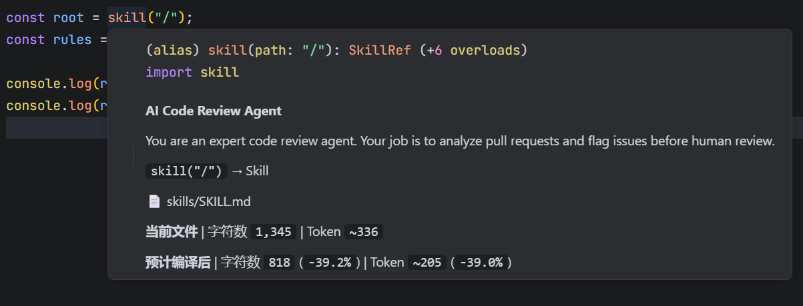

# review-skill

TypeScript Agent Skill 编译器 — 类型安全引用、Token 统计、零 IDE 插件。


语言：[English](README.md) | 简体中文

## 导航

- [功能介绍](#功能介绍)
- [快速开始](#快速开始)
- [不同 Agent 框架如何接入](#不同-agent-框架如何接入)
- [配置](#配置)

`review-skill` 帮开发者把 Agent 指令当成工程资产来管理。你用 Markdown 编写可复用 Skill，编译一次，然后在 TypeScript 中通过生成的 `@review-skill/skill` 路径别名安全引用。

### 定位

```
你写的 Markdown               review-skill 编译            agent 读取
skills/                        ↓                           .skill/runtime/
  SKILL.md          →          token 最优运行时              system prompt
  review/rules.md   →          类型化导入                    rules.content
```

其他工具把 Markdown 注入 AGENTS.md 或生成独立 agent。**review-skill 面向 TypeScript 开发者，把 Skill 当成代码依赖来追踪**——自动补全、Hover 信息、类型检查、Token 统计，全部由编译器生成，零插件。

## 功能介绍

### 1. 用 Markdown 编写 Skill

把 Agent 行为放在清晰的 `skills/` 目录中。源码里的 Markdown 保持可读，生成的运行时产物放在 `.skill/` 中。

```text
skills/
|-- SKILL.md
|-- react/
|   |-- SKILL.md
|   `-- rules/
|       |-- effects.md
|       `-- state.md
`-- security/
    |-- SKILL.md
    `-- owasp.md
```

### 2. 自动补全所有 Skill 路径

编译后，`skill("/")` 以及每个嵌套 Skill/resource 路径都会进入编辑器提示。你不再需要手写脆弱的相对 `readFile(...)` 路径。


```ts
import { skill } from "@review-skill/skill";

const root = skill("/");
const rules = skill("/react/rules/state.md");
```

### 3. 在 TypeScript 悬浮提示中查看 Skill 元信息

在支持 TypeScript 的编辑器里，把光标悬停到生成的 `skill()` 调用上，可以看到 Skill 标题、描述、源文件、当前字符数/token、预计编译后的运行时大小和节省比例。



### 4. 输出更省 token 的 prompt 内容

`review-skill` 会清理代码块外的 prompt 噪声，包括注释、格式标记、图片语法、多余空行和行尾空白。代码示例会原样保留。

开发时为了结合业务，我们写 Markdown 时会尽量声明意图，让它适合开发者或者 Claude Code、Codex 等工具阅读，所以它可以保留注释、格式、空行、表格和内部说明。


对开发者有帮助的格式和说明，并不一定都需要进入模型运行时。`review-skill` 将开发态 Markdown 和运行态 Markdown 分离，只保留执行所需内容。


### 5. 接入任意 Agent 技术栈

编译后的资源就是普通 Markdown 字符串，可以作为 system prompt、developer instruction、工具规则、审查策略或 RAG 片段使用。

## 快速开始

### 1. 安装

```bash
npm install review-skill
```

### 2. 初始化

```bash
npx review-skill --init
```

这会创建 `skills/SKILL.md`，把 `.skill/` 加入 `.gitignore`，生成 `skill.config.js` 或 `skill.config.mjs`，配置 `@review-skill/skill` TypeScript 路径别名，并在可能时添加常用 npm scripts。

### 3. 编写 Skill

```markdown
# React Code Review

You are an expert React reviewer. Focus on correctness, state management,
effects, rendering performance, and security-sensitive patterns.

See `skill("/react/rules/state.md")` for state rules.
See `skill("/react/rules/effects.md")` for effect rules.
```

### 4. 编译

```bash
npx review-skill
```

也可以使用初始化时生成的 scripts：

```bash
npm run skill:build
npm run skill:dev
```

示例输出：

```text
Compiled 6 files in 91ms
  3 skills | Source 2145 -> Runtime 1751 tokens | -18.4%
```

### 5. 使用生成的运行时

```ts
import { skill } from "@review-skill/skill";

const rules = skill("/react/rules/state.md");

console.log(rules.meta.title);
console.log(rules.meta.runtime.tokens);

const markdown = rules.content;
```

## 不同 Agent 框架如何接入

### LangChain

把编译后的 Skill 资源作为 system message。

```ts
import { ChatOpenAI } from "@langchain/openai";
import { skill } from "@review-skill/skill";

const rules = skill("/react/rules/state.md");
const llm = new ChatOpenAI({ model: "gpt-4o" });

const result = await llm.invoke([
  { role: "system", content: rules.content },
  { role: "user", content: `Review this code:\n\`\`\`tsx\n${userCode}\n\`\`\`` },
]);
```

### Mastra

把编译后的 Markdown 作为 Agent instructions。

```ts
import { Agent } from "@mastra/core";
import { skill } from "@review-skill/skill";

const review = skill("/react");
const rules = skill("/react/rules/state.md");

const agent = new Agent({
  name: review.meta.title,
  instructions: rules.content,
  model: "openai/gpt-4o",
});
```

### Vercel AI SDK

把编译后的 Markdown 传给 `system`。

```ts
import { generateText } from "ai";
import { skill } from "@review-skill/skill";

const rules = skill("/react/rules/state.md");

const { text } = await generateText({
  model: "openai/gpt-4o",
  system: rules.content,
  prompt: `Review this code:\n${code}`,
});
```

### OpenAI SDK

把编译后的 Markdown 作为 developer instruction。

```ts
import OpenAI from "openai";
import { skill } from "@review-skill/skill";

const rules = skill("/react/rules/state.md");
const client = new OpenAI();

const response = await client.responses.create({
  model: "gpt-4.1",
  input: [
    { role: "developer", content: rules.content },
    { role: "user", content: `Review this code:\n${code}` },
  ],
});
```

### 自定义 Agent

读取编译后的资源文件，再把 Markdown 字符串交给你自己的 prompt builder。

```ts
import { skill } from "@review-skill/skill";

const guide = skill("/security/owasp.md");

agent.setSystemPrompt(guide.content);
```

## 配置

`skill.config.js` 控制编译时清理哪些元素——`strip` 是**基于字符的 token 数组**：列出想剥离的精确 markdown 语法字面量（每个都有 TS 自动补全），省略即保留。**完全不配置 `strip` = 不剥离任何内容，原样返回文件**：

```js
import { defineConfig } from "review-skill";

export default defineConfig({
  skillsDir: "skills",
  outputDir: ".skill",
  // 想保留的条目删掉；完全省略 strip 则原样返回：
  strip: [
    "<!-- HTML -->", // HTML 注释
    "**bold**",       // 粗体
    "*italic*",       // 斜体
    "~~strikethrough~~",
    "",    // 图片
    "> quote",        // 引用块
    "---",            // 分隔线
    "- item",         // 列表符号
    "\n\n",           // 空行折叠
  ],
});
```

可用 token（见 `STRIP_TOKENS`）：`"<!-- HTML -->"` HTML 注释 · `"**bold**"` 粗体 · `"*italic*"` 斜体 · `"~~strikethrough~~"` 删除线 · `""` 图片 · `"> quote"` 引用块 · `"---"` 分隔线 · `"- item"` 列表符号 · `"\n\n"` 空行折叠。空数组 `strip: []` 不剥离任何内容。

旧的对象形式（`strip: { formatting: false }`）仍可用但已弃用——编译器会提示等价的 token 数组。迁移指南：[docs/strip.md](docs/strip.md)。

## 引用使用原生 markdown 链接

Skill 的 prose 用**普通 markdown 链接**引用其他 skill——无需任何自定义语法：

```markdown
Follow the security constraints in [security](../security/SKILL.md) before drafting.
See [state rules](../react/rules/state.md) for state management.
```

链接按**所在文件的相对位置**解析（在 `skills/` 目录结构下），编辑器侧完全由 VS Code 原生处理——输入即路径补全、Ctrl+点击跳转（含代码文件）、Ctrl+悬停预览、markdown 预览里渲染链接。无需扩展、无需配置、无需插件。

编译器把这些链接当作引用契约：

- **编译期校验**——目标解析不到已知 skill/resource 的链接会给出警告（`Unknown skill reference /path`）。
- **`bundle()`**——把链接内容递归内联成单个自包含上下文（`[text](../path)` … `[/path]` 分段），循环用 `[cycle path]` 标记守护。
- 外部 URL（`https://`）、锚点、`mailto:`、图片（``）永远不会被当作引用。

注意：引用式链接语法（`[x][id]` + `[id]: url`）暂不支持扫描——请使用内联 `[x](../path)` 形式。

## 链接

- [GitHub](https://github.com/qiao-coding/review-skill)
- [npm](https://www.npmjs.com/package/review-skill)

## License

MIT
