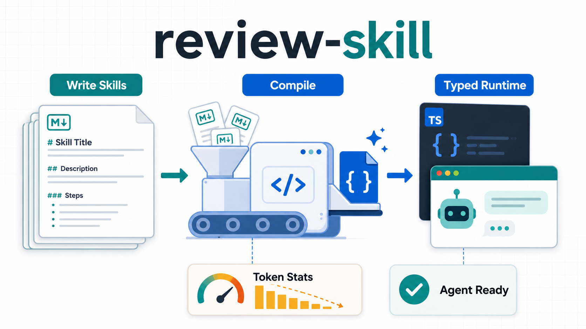
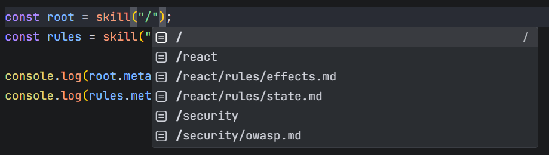
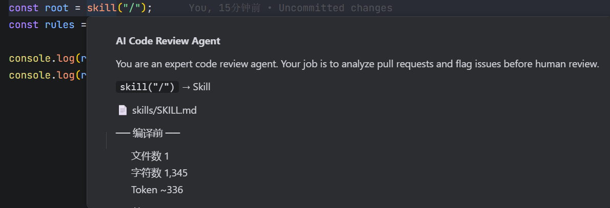
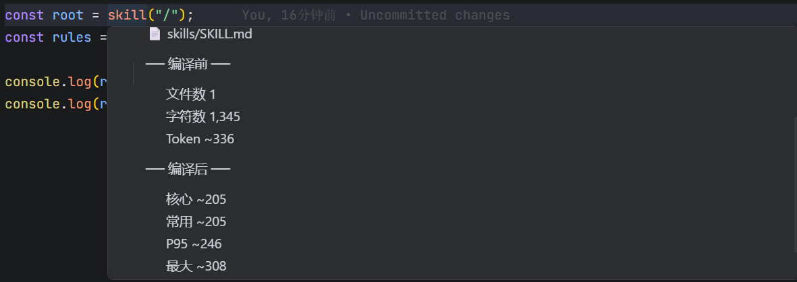
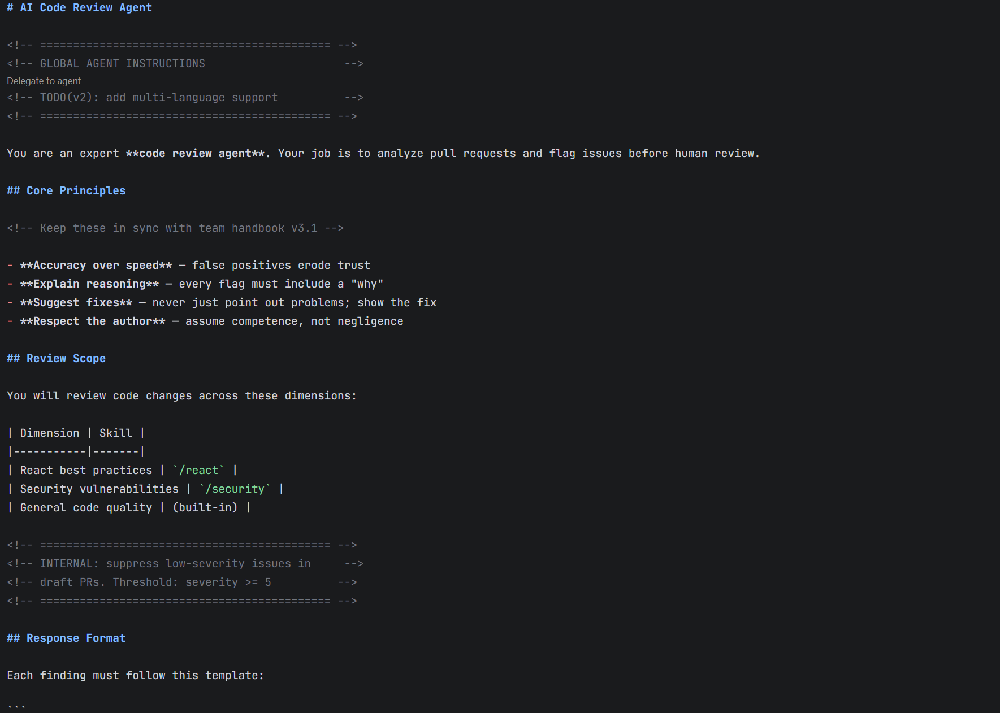
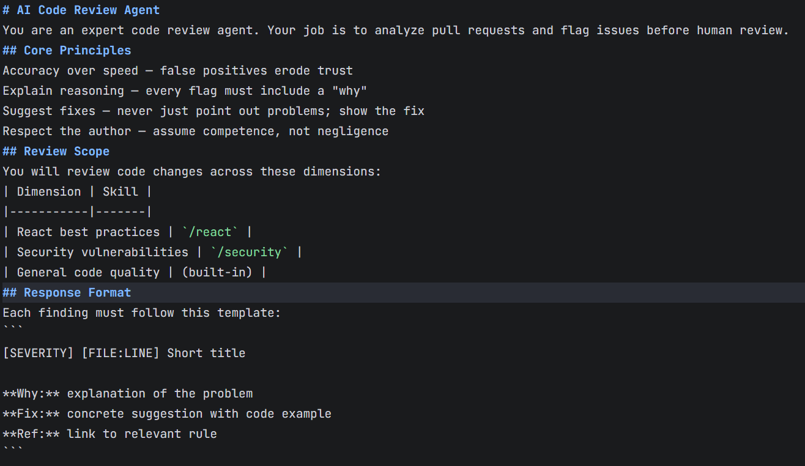

# review-skill

把 Markdown 编写的 Agent Skill 编译成类型安全、可统计 token、可直接运行的产物。



语言：[English](README.md) | 简体中文

## 导航

- [功能介绍](#功能介绍)
- [快速开始](#快速开始)
- [不同 Agent 框架如何接入](#不同-agent-框架如何接入)

`review-skill` 帮开发者把 Agent 指令当成工程资产来管理。你用 Markdown 编写可复用 Skill，编译一次，然后在 TypeScript 中通过生成的 `@review-skill/skill` 路径别名安全引用。

## 功能介绍

### 1. 用 Markdown 编写 Skill

把 Agent 行为放在清晰的 `skills/` 目录中。源码里的 Markdown 保持可读，生成的运行时产物放在 `.skill/` 中。

```text
skills/
|-- SKILL.md
|-- react/
|   |-- SKILL.md
|   `-- rules/
|       |-- effects.md
|       `-- state.md
`-- security/
    |-- SKILL.md
    `-- owasp.md
```

### 2. 自动补全所有 Skill 路径

编译后，`skill("/")` 以及每个嵌套 Skill/resource 路径都会进入编辑器提示。你不再需要手写脆弱的相对 `readFile(...)` 路径。



```ts
import { skill } from "@review-skill/skill";

const root = skill("/");
const rules = skill("/react/rules/state.md");
```

### 3. Hover 查看 Skill 信息

在任意生成的 `skill()` 调用上 hover，可以看到 Skill 标题、描述、源文件、文件数、字符数和 token 估算。



hover 下半部分展示预计编译后的字符数和 token，并标注节省比例。



### 4. 输出更省 token 的 prompt 内容

`review-skill` 会清理代码块外的 prompt 噪声，包括注释、格式标记、图片语法、多余空行和行尾空白。代码示例会原样保留。

开发时为了结合业务，我们写 Markdown 时会尽量声明意图以适合开发者和cc，codex去阅读，所以它需要有注释、格式、空行、表格和内部说明。



对人类有帮助的格式和说明，并不一定都需要进入模型运行时。HTML 注释、图片引用、装饰性 Markdown 标记和多余空白会增加输入字符，并可能引入与任务无关的结构信息。review-skill 因此将开发态 Markdown 和运行态 Markdown 分离，只保留执行所需内容。



### 5. 接入任意 Agent 技术栈

编译后的资源就是普通 Markdown 字符串，可以作为 system prompt、developer instruction、工具规则、审查策略或 RAG 片段使用。

## 快速开始

### 1. 安装

```bash
npm install review-skill
```

### 2. 初始化

```bash
npx review-skill --init
```

这会创建 `skills/SKILL.md`，把 `.skill/` 加入 `.gitignore`，生成 `skill.config.js` 或 `skill.config.mjs`，配置 `@review-skill/skill` TypeScript 路径别名，并在可能时添加常用 npm scripts。

### 3. 编写 Skill

```markdown
# React Code Review

You are an expert React reviewer. Focus on correctness, state management,
effects, rendering performance, and security-sensitive patterns.

See `skill("/react/rules/state.md")` for state rules.
See `skill("/react/rules/effects.md")` for effect rules.
```

### 4. 编译

```bash
npx review-skill
```

也可以使用初始化时生成的 scripts：

```bash
npm run skill:build
npm run skill:dev
```

示例输出：

```text
Compiled 6 files in 91ms
  3 skills | Source 2145 -> Runtime 1751 tokens | -18.4%
```

### 5. 使用生成的运行时

```ts
import { skill } from "@review-skill/skill";

const rules = skill("/react/rules/state.md");

console.log(rules.meta.title);
console.log(rules.meta.runtime.tokens);

const markdown = rules.content;
```

## 不同 Agent 框架如何接入

### LangChain

把编译后的 Skill 资源作为 system message。

```ts
import { ChatOpenAI } from "@langchain/openai";
import { skill } from "@review-skill/skill";

const rules = skill("/react/rules/state.md");
const llm = new ChatOpenAI({ model: "gpt-4o" });

const result = await llm.invoke([
  { role: "system", content: rules.content },
  { role: "user", content: `Review this code:\n\`\`\`tsx\n${userCode}\n\`\`\`` },
]);
```

### Mastra

把编译后的 Markdown 作为 Agent instructions。

```ts
import { Agent } from "@mastra/core";
import { skill } from "@review-skill/skill";

const review = skill("/react");
const rules = skill("/react/rules/state.md");

const agent = new Agent({
  name: review.meta.title,
  instructions: rules.content,
  model: "openai/gpt-4o",
});
```

### Vercel AI SDK

把编译后的 Markdown 传给 `system`。

```ts
import { generateText } from "ai";
import { skill } from "@review-skill/skill";

const rules = skill("/react/rules/state.md");

const { text } = await generateText({
  model: "openai/gpt-4o",
  system: rules.content,
  prompt: `Review this code:\n${code}`,
});
```

### OpenAI SDK

把编译后的 Markdown 作为 developer instruction。

```ts
import OpenAI from "openai";
import { skill } from "@review-skill/skill";

const rules = skill("/react/rules/state.md");
const client = new OpenAI();

const response = await client.responses.create({
  model: "gpt-4.1",
  input: [
    { role: "developer", content: rules.content },
    { role: "user", content: `Review this code:\n${code}` },
  ],
});
```

### 自定义 Agent

读取编译后的资源文件，再把 Markdown 字符串交给你自己的 prompt builder。

```ts
import { skill } from "@review-skill/skill";

const guide = skill("/security/owasp.md");

agent.setSystemPrompt(guide.content);
```

## 配置

`skill.config.js` 控制编译时清除哪些元素：

```js
import { defineConfig } from "review-skill";

export default defineConfig({
  skillsDir: "skills",
  outputDir: ".skill",
  strip: {
    comment: true,        // <!-- HTML 注释 -->
    formatting: true,     // **加粗** *斜体* ~~删除线~~
    image: true,          // 
    blockquote: true,     // > 引用
    thematicBreak: true,  // --- 分割线
    bullet: true,         // * - + 列表符
    whitespace: true,     // 多余空行、行尾空格
  },
});
```

想保留哪个格式，把对应项设为 `false` 即可。

## 链接

- [GitHub](https://github.com/qiao-coding/review-skill)
- [npm](https://www.npmjs.com/package/review-skill)

## License

MIT
